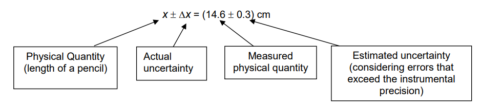

# **Uncertainties**

A measurement of a physical quantity X is reported in the form, X = (x $\pm$ $\Delta$ x) where $\Delta$ x refers to the uncertainty associated with the measurement of X.

<!--prettier-ignore-->
!!! definition "Definition"
    The **fractional uncertainty** is the ratio of the actual uncertainty to the measured value.

    $$
    \frac{\Delta x}{x}
    $$

<!--prettier-ignore-->
!!! definition "Definition"
    The **percentage uncertainty** is obtained by converting the fractional uncertainty into percentage form.

    $$
    \frac{\Delta x}{x} \times 100\%
    $$

## **Significant Figures and Decimal Places**

1. Express uncertainties to 1 s.f
2. Express the quantity to the same place value as its uncertainty.

## **Combining Uncertainties**

### Adding or Subtracting

- For $c = a + b$, the actual uncertainty in $c$, $\Delta c = \Delta a + \Delta b$
- For $d = a - b$, the actual uncertainty in $d$, $\Delta d = \Delta a + \Delta b$

### **Multiplying or Dividing Measured Quantities**

- For $p = ab$, the fractional uncertainty in $p$, $\frac{\Delta p}{p} = \frac{\Delta a}{a} + \frac{\Delta b}{b}$

- For $q = \frac{a}{b}$, the fractional uncertainty in $q$, $\frac{\Delta q}{q} = \frac{\Delta a}{a} + \frac{\Delta b}{b}$

### **Scaling**

- If $r = ka$, then $\Delta r = k(\Delta a)$, where $k$ is a constant.

### **Powers**

- If $s = a^n$, then $\frac{\Delta s}{s} = |n| \frac{\Delta a}{a}$

### **Complicated Equations**

Actual uncertainty of $X$

$$
\Delta X = \frac{1}{2}(\text{maximum possible } X - \text{minimum possible } X)
$$

$$
\Delta X = \frac{1}{2}(X_{\max} - X_{\min})
$$
