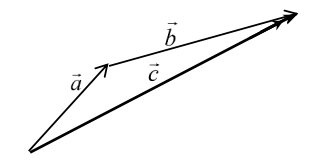

# **Scalars and Vectors**

<!--prettier-ignore-->
!!! definition "Definition""
    Scalar quantities are physical quantities that have only magnitudes.

<!--prettier-ignore-->
!!! definition "Definition""
    Vector quantities are physical quantities that have both magnitudes and directions.

## **Resolution of Vectors**

## **Combining 1D Vectors**

In 1D, there are only 2 directions. Therefore, we can choose one to be positive and the other to be negative.

To combine 1D vectors

1. State Sign Convention (decide which direction is positive and which is negative)
2. Add the vectors together to obtain the resultant vector. (the sign of the resultant vector indicates the direction of it)

## **Combining 2D Vectors**

### **Head to Tail Method (Graphical)**

### **Resolution**

1. Resolve both vectors
2. Combine the horizontal and the vertical components to find the **resultant** horizontal vertical components
3. Use Pythagoras Theorem to determine the magnitude of the resultant vector
4. Use $tan^{-1}$ to determine the angle/direction

