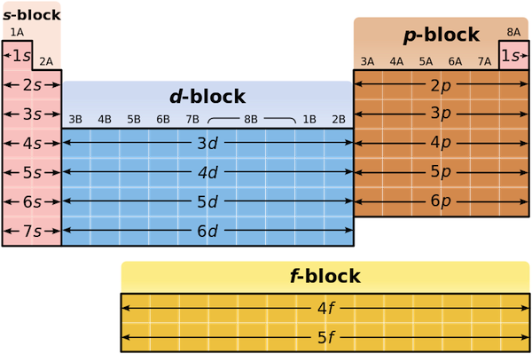

# **Introudction to Transition Elements**

## **s, p and d blocks**

The periodic table can be divided into s-block, p-block and d-block based on the electronic configuration of the atoms.

<table>
  <tr>
    <th>group number</th>
    <th>valence shell electronic configuration</th>
    <th>block</th>
  </tr>
  <tr>
    <td>1</td>
    <td>\(ns^1\)</td>
    <td rowspan="2">s</td>
  </tr>
  <tr>
    <td>2</td>
    <td>\(ns^2\)</td>
  </tr>
  <tr>
    <td>3</td>
    <td>\((n-1)d^1 \, ns^2\)</td>
    <td rowspan="10">d</td>
  </tr>
  <tr>
    <td>4</td>
    <td>\((n-1)d^2 \, ns^2\)</td>
  </tr>
  <tr>
    <td>5</td>
    <td>\((n-1)d^3 \, ns^2\)</td>
  </tr>
  <tr>
    <td>6</td>
    <td>\((n-1)d^4 \, ns^2\)</td>
  </tr>
  <tr>
    <td>7</td>
    <td>\((n-1)d^5 \, ns^2\)</td>
  </tr>
  <tr>
    <td>8</td>
    <td>\((n-1)d^6 \, ns^2\)</td>
  </tr>
  <tr>
    <td>9</td>
    <td>\((n-1)d^7 \, ns^2\)</td>
  </tr>
  <tr>
    <td>10</td>
    <td>\((n-1)d^8 \, ns^2\)</td>
  </tr>
  <tr>
    <td>11</td>
    <td>\((n-1)d^9 \, ns^2\)</td>
  </tr>
  <tr>
    <td>12</td>
    <td>\((n-1)d^{10} \, ns^2\)</td>
  </tr>
  <tr>
    <td>13</td>
    <td>\(ns^2 \, np^1\)</td>
    <td rowspan="6">p</td>
  </tr>
  <tr>
    <td>14</td>
    <td>\(ns^2 \, np^2\)</td>
  </tr>
  <tr>
    <td>15</td>
    <td>\(ns^2 \, np^3\)</td>
  </tr>
  <tr>
    <td>16</td>
    <td>\(ns^2 \, np^4\)</td>
  </tr>
  <tr>
    <td>17</td>
    <td>\(ns^2 \, np^5\)</td>
  </tr>
  <tr>
    <td>18</td>
    <td>\(ns^2 \, np^6\)</td>
  </tr>
</table>

## **Transition Metal**

<!-- prettier-ignore -->
!!! Defintion
    A transition metal is a d-block element that form one or more stable ions with a partially filled d subshell.

<!-- prettier-ignore -->
!!! Important
    Zn and Sc are d block elements but they are not transition metal.

    - Zn forms $Zn^{2+}$ with a **fully filled d subshell** $1s^2 \, 2s^2 \, 2p^6 \, 3s^2 \, 3p^6 \, 3d^{10}$
    - Sc forms $Sc^{3+}$ with a **empty d subshell** $1s^2 \, 2s^2 \, 2p^6 \, 3s^2 \, 3p^6$
