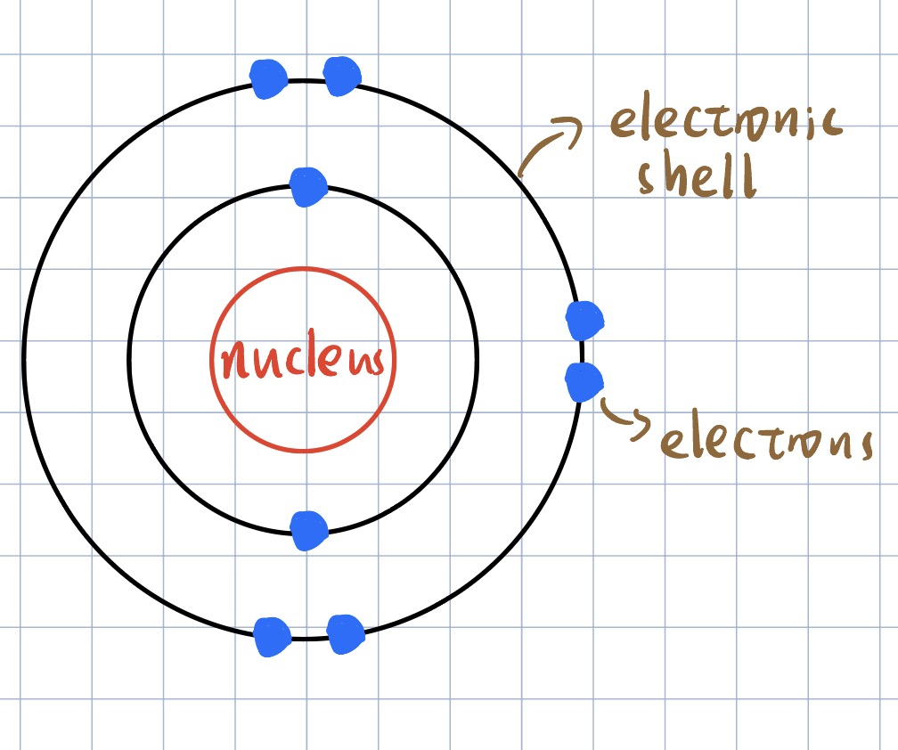

# **Principal Quantum Shells, Subshells and Orbitals**

|      | Learning Outcomes                                                                                                                                   |
| ---- | --------------------------------------------------------------------------------------------------------------------------------------------------- |
| 1(f) | describe the number of the relative energies of the s, p and d orbitals for the principal quantum number 1, 2 and 3 and also the 4s and 4p orbitals |

# **Principal Quantum Shells**

Previously in O level, we learn that electrons reside in **electronic shells**.

However, now we have levelled up to A level and we will call these shells as **principal quantum shells**.

Each principal quantum shell is assigned with a **principal quantum number**

As the principal quantum number increases, **size**, **maximum number of electrons ($2n^{2}$)**, and **energy level** increases.

| principal quantum number               | 1   | 2   | 3   | 4   |
| -------------------------------------- | --- | --- | --- | --- |
| maximum number of electrons ($2n^{2}$) | 2   | 8   | 18  | 32  |

# **Subshells**

<!-- prettier-ignore-->
!!! Tip
    Think of principal quantum shells like different hotels of a particular chain.
    Subshells are the storeys in the hotels.

Each principal quantum shell can be divided into subshells. The number of subshells in a principal quantum shell is the same as its principal quantum number.

| principal quantum number, n | number of subshell | types of subshells | notation for subshells |
| --------------------------- | ------------------ | ------------------ | ---------------------- |
| 1                           | 1                  | s                  | 1s                     |
| 2                           | 2                  | s, p               | 2s, 2p                 |
| 3                           | 3                  | s, p, d            | 3s, 3p, 3d             |
| 4                           | 4                  | s, p, d, f         | 4s, 4p, 4d, 4f         |

In the **same** principal quantum shell, the energy level of subshells increases in the order of s < p < d < f.

For subshells in **different** principal quantum shells, subshells in quantum shells with higher principal quantum number have higher energy levels. That is 1s < 2s < 3s.

# **Orbitals**

**An atomic orbital is the region of space with 90% probability of finding an electron**.

- Subshells have orbitals at the **same energy level (degenerate)** but **different orientations** in space.
- Each orbital can contain up to **2 electrons**.

| subshell | number of orbitals | maximum number fo electrons in each subshell |
| -------- | ------------------ | -------------------------------------------- |
| s        | 1                  | 2                                            |
| p        | 3                  | 6                                            |
| d        | 5                  | 10                                           |
| f        | 7                  | 14                                           |

# **Summary**

| principal quantum number, n | subshell                   | number of orbitals     | maximum number of electrons in each principal quantum shell, $2n^{2}$ |
| --------------------------- | -------------------------- | ---------------------- | --------------------------------------------------------------------- |
| 1                           | 1s                         | 1                      | 2                                                                     |
| 2                           | 2s   2p                 | 1   3               | 8                                                                     |
| 3                           | 3s   3p   3d         | 1   3   5        | 18                                                                    |
| 4                           | 4s   4p   4d   4f | 1   3   5   7 | 32                                                                    |
