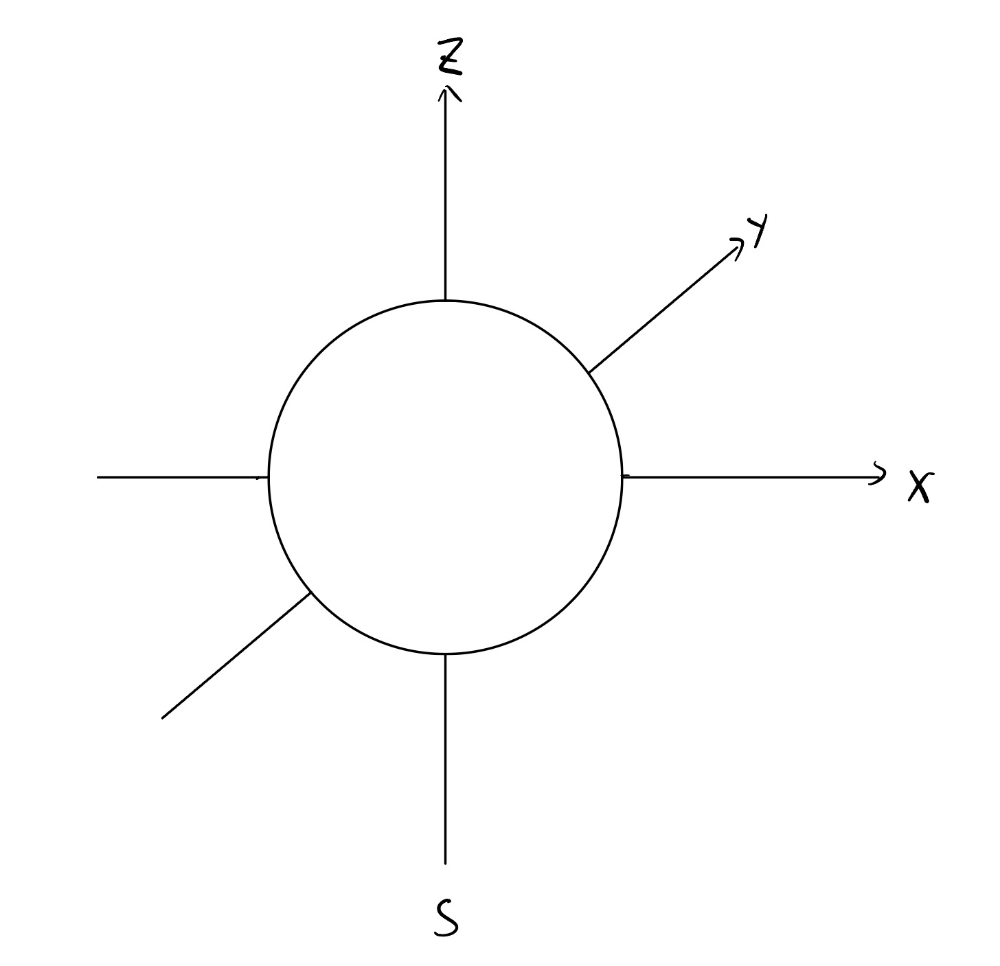
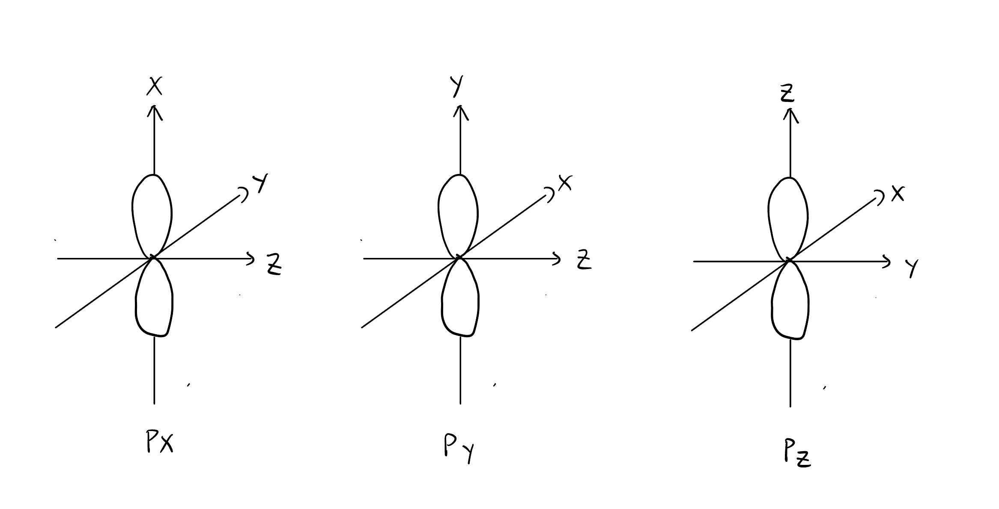
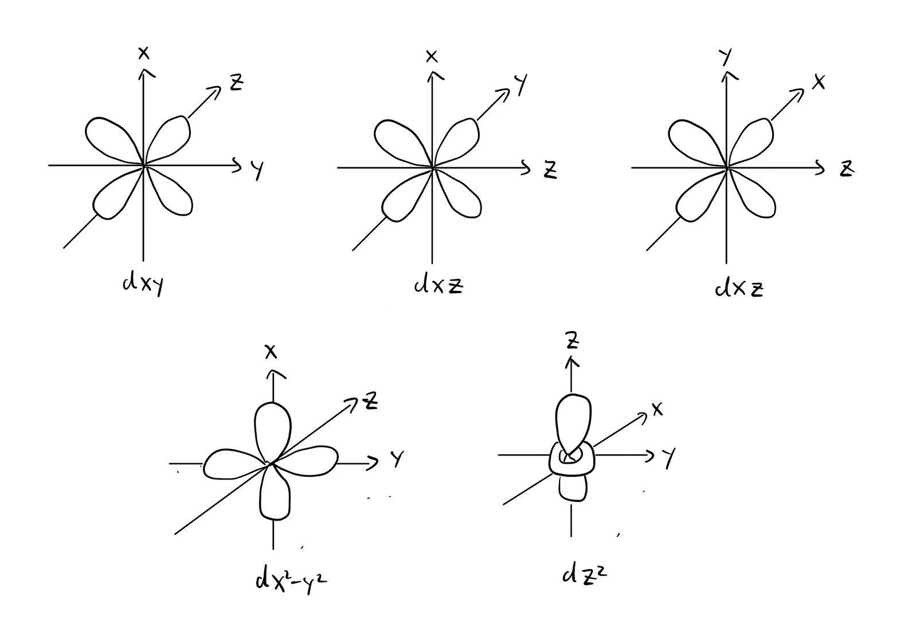

# **Shapes of Orbitals**

|      | Learning Outcomes                          |
| ---- | ------------------------------------------ |
| 1(g) | describe the shapes of s, p and d orbitals |

# **The s Orbital**

Each s subshell only has one s orbital.

s orbitals are **spherical** in shape.

The size of s orbitals increase with the principal quantum number, 1s < 2s < 3s < ...

# **The p Orbital**

Each p subshell has three p orbitals.

The p orbital is **dumb-bell** in shape.

The three p orbitals in the same quantum shell are **identical in size, shape and energy level (degenerate)** but differ in their **spatial orientation**. The three p orbitals are named $P_x, P_y, P_z$.

The size and energy level of p orbitals increase with the principal quantum number, so 2p < 3p < 4P <...

# **The d Orbital**

Each d subshell has five d orbitals.

The 5 d orbitals are **degenerate**.

The five d orbitals are named $d_{xy}$, $d_{xz}$, $d_{yz}$, $d_{x^2-y^2}$ and $d_{z^2}$.

