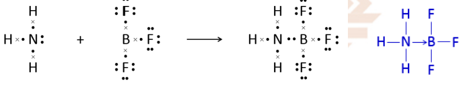
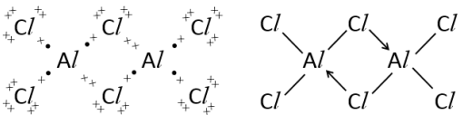
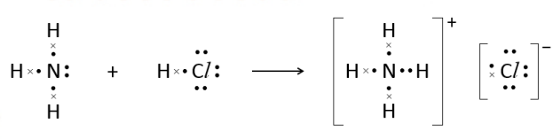

# **Dative Bonding**

A **co-ordinate bond** or **dative bond** between two atoms is a covelent bond in which **both** bonding electrons come from one atom.

- To form a dative bond, the **donor atom** must have a **lone pair**
- The **acceptor atom** must contain an **empty orbital** in its valence shell

**Example** $\mathrm{NH_3BF_3}$

**Example** $\mathrm{Al_2Cl_6}$

**Example** $\mathrm{NH^+_4}$

