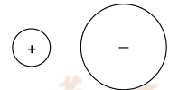
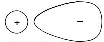

# **Ionic Bonding with Covalent Character**

In **ideal** ionic bonding, there is **complete electron transfer**.

The nucleus of the cation and that of the anion only attracts its own electrons.

However, the cation tends to attract electrons of anion causing the electron cloud of the anion to be **polarised** or **distorted**

## **Factors thats affects Degree of Covalent Character**

### **Polarising Power of Cation**

- Cations with **high charge density** (small radius and high charge) have **high polairsing power**.
- These cations have a higher tendency to distort the anions' electron cloud, resulting in **greater covalent character** in ionic bonding

### **Polarisability of the anion**

- Anions that are **large** (large number of electrons or larger radius) have high polarisability.
- This is because their valence electrons are further from and less attracted by the nucleus.
- Thus, the electron cloud is easily distorted by a cation, resulting in **greater covalent character** in the ionic bonding
