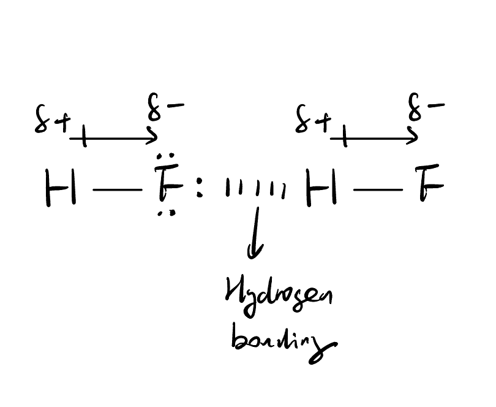

# **Hydrogen Bonding**

## **Conditions for the Formation of Hydrogen Bonding**

- The molecule must contain a **hydrogen atom bonded to** a highly electronegative atom (**F / O / N**)
- There must be an **atom** (**F / O / N**) **with a lone pair of electrons**

## **How is Hydrogen Bonding formed?**

Let's use $H_2O$ as an example

- In $H_2O$, the shared electrons in the H-O single bond are pulled towards the **highly electronegative** oxygen atom. 

- Thus, the hydrogen atom has no electron left in its nucleus is **highly electron deficient** and has a very **large $\delta+$ partial charge**. 

- The **lone pair** on oxygen is able to attract the electron deficient hydrogen atom. 

- The electrostatic force of attraction between the lone pair and the hydrogen atom is hydrogen bonding. 

## **Drawing Hydrogen Bonding in Exams**

- **Label the dipole** for the covalent bond (N-H / O-H / F-H) with $\delta+$ and $\delta-$

- Draw the **lone pair** on N / O / F

- **Indicate and lable the hydrogen bonding** using dotted / dashed line. 

## **Strength and Extent of Hydrogen Bonding**

- The **electronegativity** of the atom that H atom is bonded to affects the strength of hydrogen bonding. 
    - The electronegativity of the atom bonded to hydrogen increases in the order: $\text{N} < \text{O} < \text{F}$

    - Hence, the polarity of the $\text{H--X}$ bond increases in the order: $\text{H--N} < \text{H--O} < \text{H--F}$

    - As fluorine is the most electronegative, it withdraws electron density from hydrogen most strongly. Therefore, the hydrogen atom in $\text{H--F}$ has the largest $\delta+$ partial charge, followed by hydrogen in $\text{H--O}$, then hydrogen in $\text{H--N}$.

    - Thus, based on bond polarity alone, hydrogen bonding is generally strongest when hydrogen is bonded to fluorine, followed by oxygen, then nitrogen: $\text{H--F} > \text{H--O} > \text{H--N}$

    - However, the overall strength and effect of hydrogen bonding in a substance also depends on factors such as molecular structure, number of hydrogen bonds formed per molecule, and the extent of hydrogen bonding.

- The extent of hydrogen bonding depends on the **number of H atom** bonded to F / O / N and the **number of lone pairs** available. 
    - In $\text{H}_2\text{O}$, the hydrogen bonding is **more extensive** than in $\text{H}\text{F}$ and $\text{N}\text{H}_3$. 

    - $\text{H}_2\text{O}$ has two lone pairs and two electron deficient hydrogen atoms. 
    
    - Thus, each $\text{H}_2\text{O}$ can form 2 hydrongen bonds while $\text{H}\text{F}$ and $\text{N}\text{H}_3$ can only form 1 hydrogen bonding per molecule. 